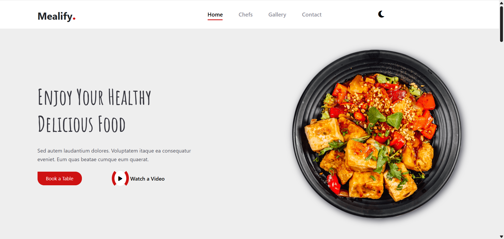

# 🍽 Mealify Landing Page

A responsive landing page for a restaurant called *Mealify*.  
The project was built using *HTML, CSS, and a bit of JavaScript*.  
It includes modern features like *responsive design* and *dark mode toggle*.

---

## 🚀 Features
- Responsive design using CSS media queries.  
- Dark mode toggle for better user experience.  
- Clean and modern restaurant landing page design.  
- Simple animations and interactions with JavaScript.  

---

## 🛠 Technologies Used
- *HTML5*  
- *CSS3* (with Media Queries for responsiveness)  
- *JavaScript* (for dark mode and interactions)  

---

## 📸 Screenshots

